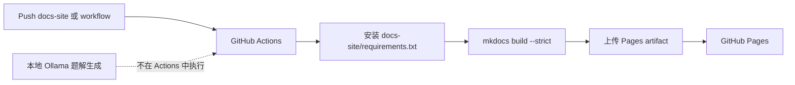

# GitHub Actions 规划

GitHub Actions 工作流应自动构建并部署 MkDocs 文档站点。

这个 workflow 的职责很窄：只发布文档，不跑题解生成。题解生成依赖本地 `merged_problems.json`、Ollama 服务和大模型硬件，不适合放到 GitHub-hosted runner 中执行。

## 触发规则

推荐触发方式：

- `main` 分支中与文档站点相关的文件变化时触发。
- 支持 `workflow_dispatch` 手动部署。

工作流不应因为无关代码变化而运行。路径过滤建议包含：

- `docs-site/**`
- `.github/workflows/docs.yml`
- 必要的文档入口文件

## 构建步骤

1. 检出仓库代码。
2. 设置 Python。
3. 安装 MkDocs 和插件。
4. 执行 `mkdocs build --strict`。
5. 上传构建产物。
6. 部署到 GitHub Pages。

## 部署边界

路径过滤的意图是减少无关运行：修改生成器代码不一定需要重新部署文档；修改 `docs-site/**` 或 `.github/workflows/docs.yml` 才需要触发站点构建。

## 权限

使用 GitHub Pages 所需的最小权限：

- `contents: read`
- `pages: write`
- `id-token: write`

这些权限只覆盖读取仓库、写 Pages artifact 和使用 OIDC 部署。workflow 不需要仓库写权限，也不需要访问模型服务。
