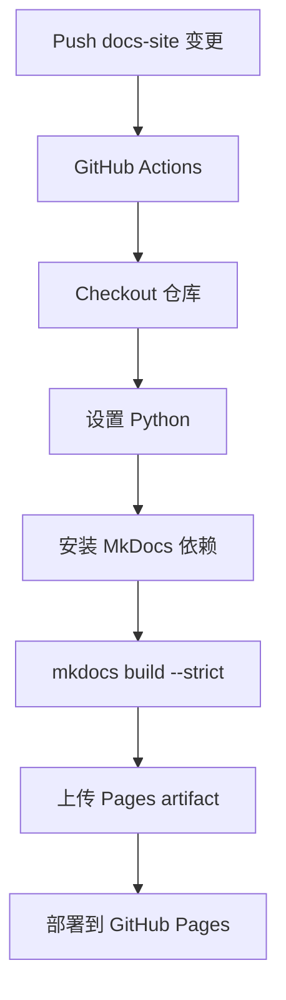

# 文档站点 GitHub Actions PRD

## 目的

本文定义本仓库文档站点所需的 GitHub Actions 工作流。

这不是通用 CI 流水线，而是 LeetCode All Languages Best Solutions 项目的文档部署流程。文档站点需要解释：

- LeetCode 是什么；
- 数据集如何在本地获取；
- 所有语言题解文件如何生成；
- Ollama 本地生成流程如何工作；
- 双语 MkDocs 文档站点如何构建和部署。

英文版位于：

- `docs-site/github_action_prd.md`

## 项目背景

本仓库生成 LeetCode 所有支持语言的准确最优解。生成结果按难度组织：

```text
Leetcode-Easy/
Leetcode-Medium/
Leetcode-Hard/
```

每个难度目录再按 100 题分桶，例如：

```text
Leetcode-Easy/0001-0100/0001-two-sum.md
Leetcode-Medium/0001-0100/0002-add-two-numbers.md
Leetcode-Hard/0001-0100/0004-median-of-two-sorted-arrays.md
```

文档站点需要解释这些产物结构，以及生成它们的工程流程。

## LLM 运行背景

生成系统使用本地 Ollama 模型流程。文档中需要说明：

- 模型族：`gpt-oss:120b`
- 量化/运行目标：q4km 风格本地部署
- 目标本地机器：Apple M2 Ultra，24 CPU 核、76 GPU 核、192 GB 统一内存
- 备用计算节点：单节点 2 张 NVIDIA H100 GPU 运行 Ollama
- 实测本地吞吐：在测试环境中约 100 tokens/second
- 加速路径：该模型适合 Apple Silicon 上的 MLX 或 MPS 相关本地推理路径，也适合单个 NVIDIA H100 节点运行 Ollama
- 生成参数：
  - Easy -> think `low`
  - Medium -> think `medium`
  - Hard -> think `high`
  - temperature `0.1`
  - 单语言生成最大输出 `100_000` tokens

这些内容应作为项目运行说明，不写成营销文案。

## 工作流目标

GitHub Actions 工作流需要自动构建和部署 MkDocs 文档站点。

它应当：

- 在文档站点文件变化时运行；
- 支持手动触发；
- 安装 MkDocs 依赖；
- 使用严格模式构建站点；
- 上传静态产物；
- 部署到 GitHub Pages。

## 预期文件结构

```text
docs-site/
  mkdocs.yml
  requirements.txt
  docs/
    en/
      index.md
      leetcode.md
      languages.md
      ollama.md
      mkdocs.md
      github-actions.md
      workflow.md
      prd.md
    cn/
      index.md
      leetcode.md
      languages.md
      ollama.md
      mkdocs.md
      github-actions.md
      workflow.md
      prd.md
```

当前 `docs-site/en/` 和 `docs-site/cn/` 下的规划文档可作为第一版内容。

## 触发规则

推荐工作流触发方式：

```yaml
on:
  push:
    branches: [main]
    paths:
      - "docs-site/**"
      - ".github/workflows/docs.yml"
  workflow_dispatch:
```

无关代码变化不应触发文档部署。

## 权限

使用 GitHub Pages 所需最小权限：

```yaml
permissions:
  contents: read
  pages: write
  id-token: write
```

## 推荐工作流



## Job 职责

工作流应只有一个清晰的文档部署 job：

1. 检出仓库。
2. 设置 Python。
3. 安装文档依赖。
4. 构建 MkDocs 站点。
5. 上传静态站点。
6. 部署到 GitHub Pages。

不要把生成器测试、数据集下载或题解生成混入文档部署 job。

## 验收标准

满足以下条件时，GitHub Actions 实现可接受：

- 存在 `.github/workflows/docs.yml`。
- 支持带路径过滤的 `push` 和 `workflow_dispatch`。
- 从 `docs-site/` 构建 MkDocs 站点。
- 使用严格构建模式。
- 部署到 GitHub Pages。
- 工作流可读、适配当前项目，并且足够容易长期维护。
