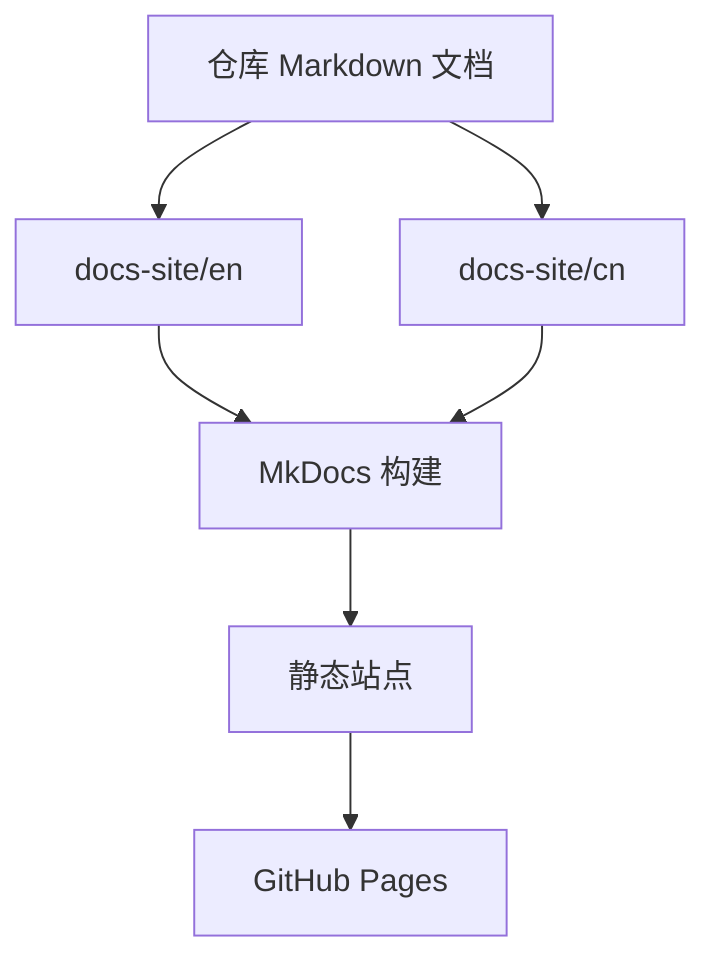

# 文档站点规划

本组文档用于说明 LeetCode All Languages Best Solutions 项目的 MkDocs 文档站点和 GitHub Actions 工作流规划。

文档需要让不了解 LeetCode、不了解多语言题解、不了解本地生成流程的读者也能快速理解项目。

## 文件结构

```text
docs-site/
  en/
    index.md
    leetcode.md
    languages.md
    ollama.md
    mkdocs.md
    github-actions.md
    workflow.md
    prd.md
  cn/
    index.md
    leetcode.md
    languages.md
    ollama.md
    mkdocs.md
    github-actions.md
    workflow.md
    prd.md
```

## Mermaid 总览



## 栏目

- `leetcode.md`: LeetCode 是什么，以及题目数据长什么样。
- `languages.md`: 支持语言和各语言提交入口特点。
- `ollama.md`: 本地生成流程、think 强度、温度和输出限制。
- `mkdocs.md`: MkDocs 站点结构和双语导航。
- `github-actions.md`: 自动构建与部署工作流。
- `workflow.md`: 端到端工作流图。
- `prd.md`: 文档站点实现要求。

