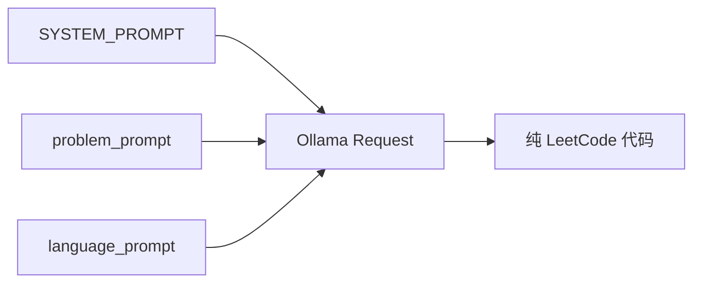
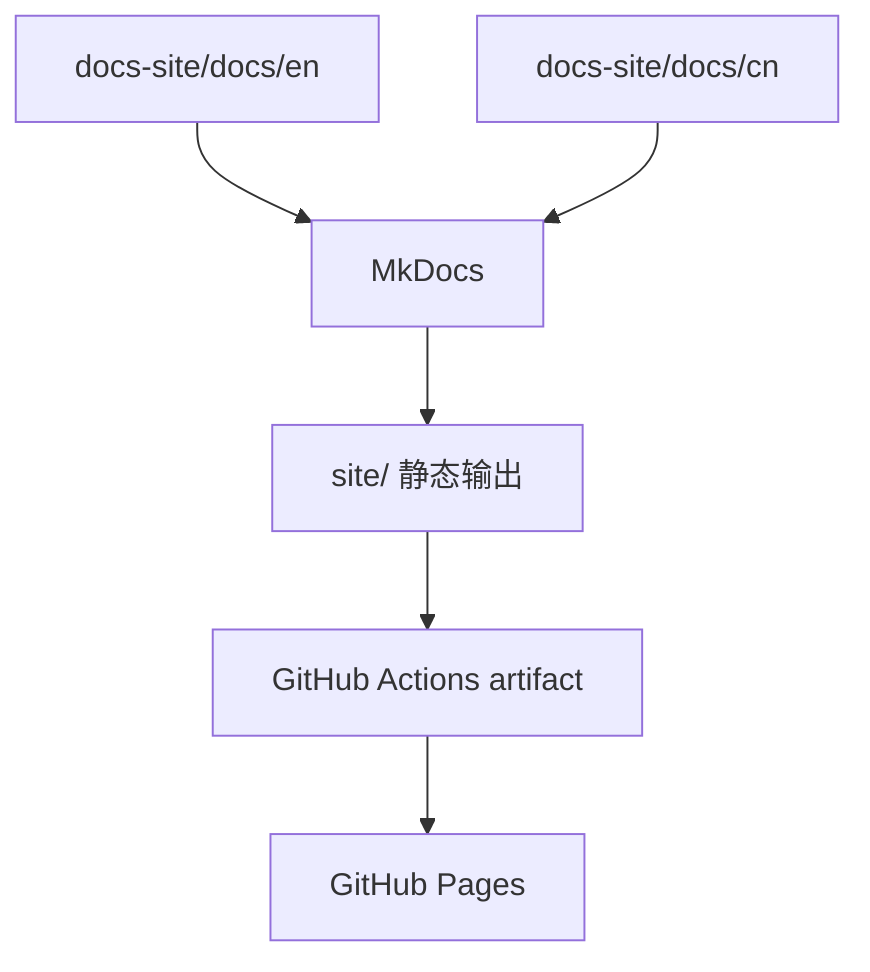

# MkDocs 双语文档站点 PRD

## 目的

本文定义 LeetCode All Languages Best Solutions 项目的 MkDocs 文档站点。

站点不应是通用占位文档，而应解释当前项目：

- LeetCode 和题目格式；
- 支持的编程语言；
- solution Markdown 文件如何组织；
- 本地 Ollama 生成流程；
- GitHub Actions 部署；
- 中英文双语文档结构。

英文版位于：

- `docs-site/mkdocs_prd.md`

## 站点目标

MkDocs 站点需要帮助读者理解：

- 仓库产出什么；
- 数据集从哪里来；
- 为什么输出拆成 `easy/`、`medium/`、`hard/`；
- 每个题目文件如何包含所有语言题解；
- prompt 复用如何工作；
- Ollama 如何在本地运行；
- GitHub Actions 如何发布文档站点。

## 内容架构

站点使用英文和中文两个文件夹：

```text
docs-site/
  docs/
    en/
    cn/
```

两套语言结构应尽量镜像。

推荐页面：

```text
en/
  index.md
  leetcode.md
  languages.md
  ollama.md
  mkdocs.md
  github-actions.md
  workflow.md
  prd.md

cn/
  index.md
  leetcode.md
  languages.md
  ollama.md
  mkdocs.md
  github-actions.md
  workflow.md
  prd.md
```

## 必须覆盖的主题

### LeetCode

说明 LeetCode 是算法练习平台，并解释常见题目字段：

- title；
- frontend id；
- difficulty；
- topics；
- description；
- examples；
- constraints；
- hints；
- solution/editorial reference；
- language starter code。

### 支持语言

说明项目支持数据集中 `code_snippets` 提供的所有语言，包括：

C、C++、Java、Python、Python3、C#、JavaScript、TypeScript、PHP、Swift、Kotlin、Dart、Go、Ruby、Scala、Rust、Racket、Erlang、Elixir。

每种语言都应简要说明其 LeetCode 提交风格，例如 `class Solution`、`impl Solution`、函数签名、模块或 contract。

### Ollama 运行环境

用实际工程语言说明本地生成配置：

- 使用 Python `ollama` 包；
- 不直接使用 `requests`；
- 模型：`gpt-oss:120b`；
- q4km 风格本地运行目标；
- Apple M2 Ultra 目标机器：24 CPU 核、76 GPU 核、192 GB 统一内存；
- 备用目标：单节点 2 张 NVIDIA H100 GPU 运行 Ollama；
- 测试环境下吞吐可达到约 100 tokens/second；
- Apple Silicon 上可关注 MLX 或 MPS 加速路径，2 张 H100 的单节点是高吞吐 NVIDIA 方案；
- 温度固定为 `0.1`；
- 输出限制为 `100000` tokens；
- Easy/Medium/Hard 对应 low/medium/high think 模式。

### Prompt 复用

记录三层 prompt 结构：



说明：

- system prompt 全局复用；
- problem prompt 在同一道题的所有语言间复用；
- language prompt 只随目标语言和 starter code 变化；
- 最终输出必须保留 LeetCode 提交入口。

### GitHub Actions

说明 GitHub Actions 如何构建 MkDocs 站点并部署到 GitHub Pages。

## MkDocs 要求

MkDocs 配置应包含：

- site name；
- theme 配置；
- navigation；
- Markdown extensions；
- Mermaid 支持；
- 双语结构；
- GitHub Pages 部署兼容。

## Mermaid 站点流程



## 验收标准

MkDocs 文档规划满足以下条件时视为完成：

- 存在英文和中文文件夹。
- 站点解释 LeetCode、语言、Ollama、MkDocs、GitHub Actions 和工作流图。
- 内容拆成多个文件。
- 包含 Mermaid 图。
- 站点规划适配当前仓库和当前实现。
