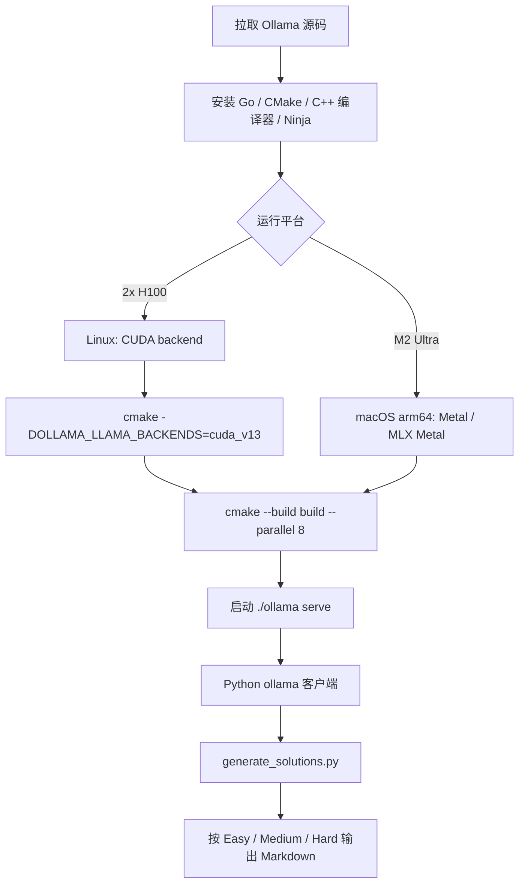
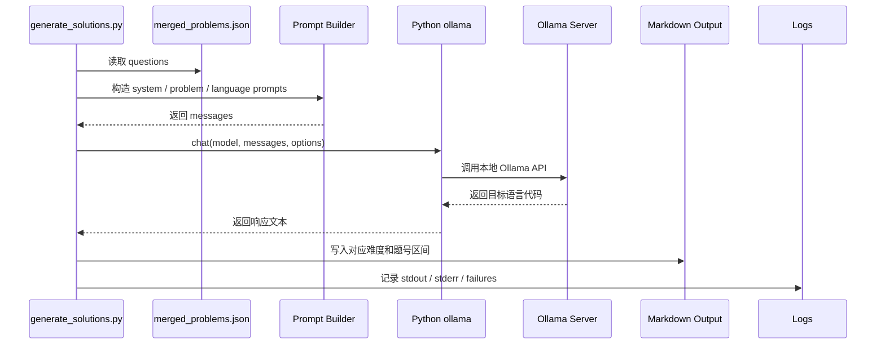
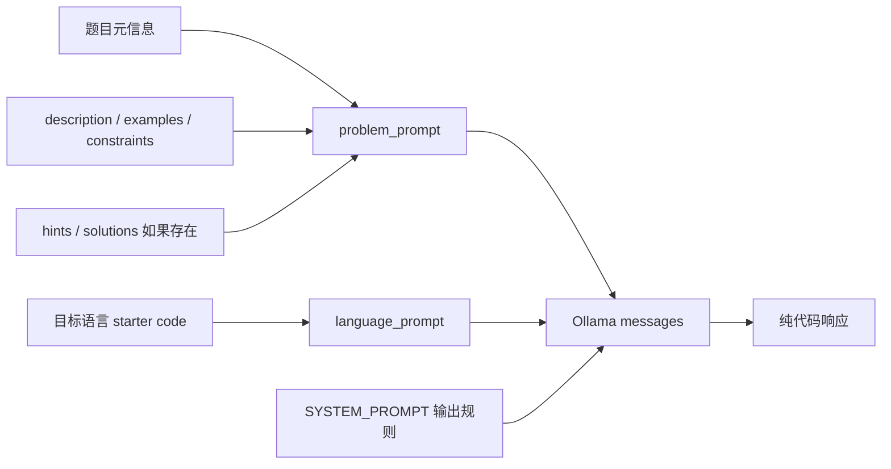
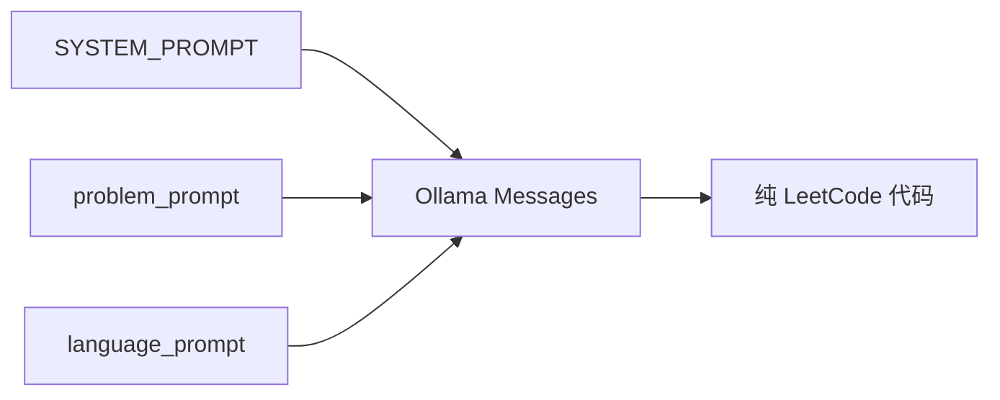

# Ollama 生成流程

项目使用 Python `ollama` 包作为模型客户端封装，不直接用 `requests` 调 HTTP。

Ollama 把本地模型运行里麻烦的部分基本封装掉了：模型加载、本地服务和请求处理都通过一个简单的本地 API 暴露出来。对本项目来说，生成器只需要通过 Python `ollama` 包调用这个 API。

这里的重点不是把 Ollama 当成聊天工具使用，而是把它当成稳定的本地推理服务。题解生成器负责读取数据、拼 prompt、写文件和记录日志；Ollama 负责模型加载、推理执行和流式响应。这样边界清楚，后续更换机器或重跑失败项时不需要改生成器主体逻辑。

## 模型参数

当前生成参数：

- 模型：`gpt-oss:120b`
- 本地运行目标：q4km 风格部署
- Easy think 模式：`low`
- Medium think 模式：`medium`
- Hard think 模式：`high`
- 上下文长度：`128k`，实际为 `131_072` tokens
- 最大输出 tokens：`100_000`
- 温度：`0.1`
- 重试次数：`3`

参数意图：

- `gpt-oss:120b` 用于覆盖多语言 LeetCode 题解，要求模型既熟悉算法又熟悉各语言提交入口。
- `128k / 131_072` 上下文给题目描述、examples、constraints、hints 和 optional editorial 留出足够空间。
- `100_000` 最大输出 tokens 是单语言上限，避免复杂语言或长题解被截断。
- `0.1` 温度用于降低随机性，让同一题同一语言的输出更稳定。
- think 模式按难度递增，是为了把推理预算用在真正复杂的题上。

## 本地硬件背景

测试使用的本地工作站是 Apple M2 Ultra：

- 24 CPU 核
- 76 GPU 核
- 192 GB 统一内存

备用计算目标是单节点 2 张 NVIDIA H100 GPU 运行 Ollama。它使用同一套项目流程：一个节点运行 Ollama，接收题目和语言 prompt，并通过同一套仓库工具写入生成题解。

在测试环境中，吞吐可以达到约 100 tokens/second。这个速度对本项目很重要，因为每道题会生成多种语言的题解，本地吞吐会直接影响全量数据集的生成耗时。

在 Apple Silicon 上，文档应说明 MLX 和 MPS 相关加速路径；在 NVIDIA 硬件上，2 张 H100 的单节点是高吞吐方案。具体运行方式取决于本地 Ollama 构建和模型打包方式，但站点需要明确：这套流程面向高内存本地推理，而不是远程托管 API。

## 服务器源码编译

在我们的服务器上，Ollama 不只按普通安装脚本使用，而是按源码构建方式准备运行环境。这样做的原因是服务器侧需要明确控制 native runtime、CUDA backend 和模型服务进程，尤其是 2 张 H100 的单节点部署。

Ollama 本体是 Go 项目，但推理后端包含 native 代码，所以构建流程不是单纯 `go build`。官方开发流程要求准备 Go、CMake、C/C++ 编译器和 Ninja；源码根目录下可以用 `go run . serve` 做 Go 层快速迭代，也可以用 CMake 完整构建 native payload。

NVIDIA 服务器上的核心步骤是：

```bash
git clone https://github.com/ollama/ollama.git
cd ollama
cmake -B build . -DOLLAMA_LLAMA_BACKENDS=cuda_v13 -DCMAKE_CUDA_ARCHITECTURES=native
cmake --build build --parallel 8
./ollama serve
```

如果要启用 MLX CUDA engine，则服务器还需要 CUDA 13+ 和 cuDNN 9+，并使用 `OLLAMA_MLX_BACKENDS` 选择 CUDA backend：

```bash
cmake -B build . -DOLLAMA_MLX_BACKENDS=cuda_v13
cmake --build build --parallel 8
```

Apple Silicon 上的构建路径不同。macOS arm64 默认面向 Metal 推理；如果需要 MLX Metal，还要先安装 Xcode 和 Metal toolchain。M2 Ultra 本地工作站适合验证 prompt、日志和断点续跑逻辑；H100 节点适合长时间全量生成。



## 生成器调用链路



生成器使用 Python `ollama` 包，而不是手写 `requests`。原因是客户端库已经处理了 Ollama API 的数据结构和响应封装，项目代码只需要关注题目、语言、输出和失败恢复。

## Prompt 到模型的边界

传给模型的内容包括题目文本信息和该语言 starter code，不包括图片。`solutions` 存在时会作为思路参考进入题目公共 prompt；不存在时直接跳过。最终输出只接受可提交代码，不接受 Markdown 代码围栏、题目复述、复杂度解释或测试入口。



## 为什么适合本地生成

本项目反复发送稳定的 system prompt、可复用的 problem prompt，以及很小的 language prompt。本地生成适合这个项目，因为：

- 同一道题的上下文会在多种语言之间复用；
- 数据集内容不需要发送到远程 API；
- 失败语言可以在本地重试；
- 生成文件可以通过已有 Markdown 输出断点续跑。

## Prompt 分层



- `SYSTEM_PROMPT`: 所有题目和所有语言共享的全局要求。
- `problem_prompt`: 题目元信息、描述、示例、约束、提示和可选题解参考。
- `language_prompt`: 目标语言和该语言 starter code。

这种结构最大化 prompt 复用。同一道题切换语言时，只改变最后的语言 prompt。

## Prompt 示例

生成器实际发送给 Ollama 的 messages 是三个元素，顺序固定：

```python
[
    {"role": "system", "content": SYSTEM_PROMPT},
    {"role": "user", "content": problem_prompt},
    {"role": "user", "content": language_prompt},
]
```

`SYSTEM_PROMPT` 放全局规则，所有题目和所有语言都相同。它约束模型只输出可提交代码：

```text
You are a senior algorithm engineer and LeetCode solution generator.
Generate only the optimal accepted solution for the requested target language.
Use the provided LeetCode starter code signature and style exactly.
Return raw code only. Do not wrap the answer in Markdown code fences.
Do not include the problem statement, explanations, complexity analysis, tests,
main functions, extra I/O, pseudocode, or unsupported dependencies.
```

`problem_prompt` 放同一道题所有语言共享的上下文。以 LeetCode 1 为例，结构大致是：

```text
# Problem Context

## Problem Metadata
- title: Two Sum
- problem_id: 1
- frontend_id: 1
- difficulty: Easy
- problem_slug: two-sum
- topics: Array, Hash Table

## Problem Statement
Given an array of integers nums and an integer target...

## Examples
- example_num: 1
- example_text: Input: nums = [2,7,11,15], target = 9 ...

## Constraints
- 2 <= nums.length <= 10^4

## Editorial / Solution Reference
Hash map based one-pass lookup...
```

`language_prompt` 只放目标语言和 starter code。以 Python3 为例：

```text
Target Language: python3

Use this LeetCode starter code signature and style:

class Solution:
    def twoSum(self, nums: List[int], target: int) -> List[int]:
        pass

Generate the optimal accepted solution for this language.
Return raw code only. Do not wrap the answer in Markdown code fences.
```

输出中必须保留 `class Solution` 和 `def twoSum(...)` 这种 LeetCode 提交入口；对于 Rust、Elixir、Racket 等语言，也必须保留对应的 `impl Solution`、`defmodule Solution do` 或 `define/contract`。

## Prompt 缓存和复用

这里的缓存不是在代码里手写一个 KV cache，而是让模型服务更容易复用相同前缀。大模型推理时，输入越稳定，前缀越长，服务端越容易复用已经处理过的 token。这个项目有两个稳定前缀：

1. `SYSTEM_PROMPT`：跨所有题目、所有语言完全相同。
2. `problem_prompt`：同一道题的所有语言完全相同。

同一道题生成多语言时，请求形态如下：

```text
语言 1: SYSTEM_PROMPT + problem_prompt(0001) + language_prompt(python3)
语言 2: SYSTEM_PROMPT + problem_prompt(0001) + language_prompt(cpp)
语言 3: SYSTEM_PROMPT + problem_prompt(0001) + language_prompt(java)
```

前三段中的前两段保持不变，只有最后的语言层变化。这样比“每次把规则、题目、语言混成一整段新 prompt”更利于缓存，也更利于定位问题：如果同一道题只有某个语言失败，通常优先检查该语言 starter code 或语言输出，而不是重新怀疑题目 prompt。

换题时，`problem_prompt` 会变化，但 `SYSTEM_PROMPT` 仍然不变：

```text
题目 1: SYSTEM_PROMPT + problem_prompt(0001) + language_prompt(...)
题目 2: SYSTEM_PROMPT + problem_prompt(0002) + language_prompt(...)
题目 4: SYSTEM_PROMPT + problem_prompt(0004) + language_prompt(...)
```

这就是为什么全局规则必须尽量放进 system prompt，题目内容必须集中放进 problem prompt，语言差异必须压缩到 language prompt。

## 失败行为

每个语言最多重试三次。超过重试次数后记录失败并继续处理下一个任务单元。

失败不阻塞全量任务是有意设计：一次全量生成可能运行很久，单个语言、单道题或一次模型超时不应该让整个批处理停止。失败项会记录题号、slug、语言、重试次数和错误信息，后续可以按题号或语言做小范围重跑。
