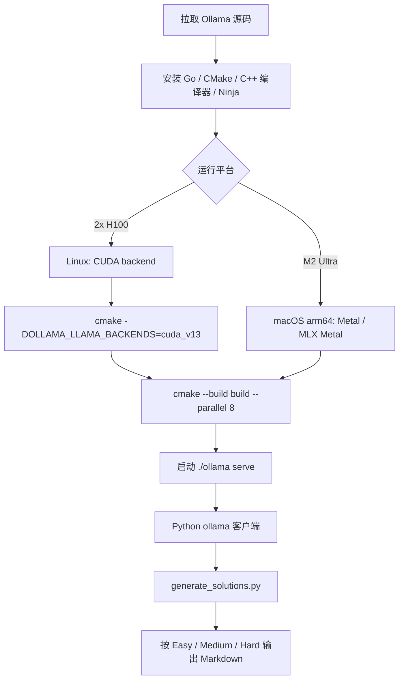
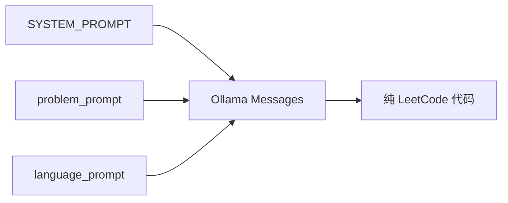

# Ollama 生成流程

项目使用 Python `ollama` 包作为模型客户端封装，不直接用 `requests` 调 HTTP。

Ollama 把本地模型运行里麻烦的部分基本封装掉了：模型加载、本地服务和请求处理都通过一个简单的本地 API 暴露出来。对本项目来说，生成器只需要通过 Python `ollama` 包调用这个 API。

## 模型参数

当前生成参数：

- 模型：`gpt-oss:120b`
- 本地运行目标：q4km 风格部署
- Easy think 模式：`low`
- Medium think 模式：`medium`
- Hard think 模式：`high`
- 上下文长度：`128k`，实际为 `131072` tokens
- 最大输出 tokens：`100000`
- 温度：`0.1`
- 重试次数：`3`

## 本地硬件背景

测试使用的本地工作站是 Apple M2 Ultra：

- 24 CPU 核
- 76 GPU 核
- 192 GB 统一内存

备用计算目标是单节点 2 张 NVIDIA H100 GPU 运行 Ollama。它使用同一套项目流程：一个节点运行 Ollama，接收题目和语言 prompt，并通过同一套仓库工具写入生成题解。

在测试环境中，吞吐可以达到约 100 tokens/second。这个速度对本项目很重要，因为每道题会生成多种语言的题解，本地吞吐会直接影响全量数据集的生成耗时。

在 Apple Silicon 上，文档应说明 MLX 和 MPS 相关加速路径；在 NVIDIA 硬件上，2 张 H100 的单节点是高吞吐方案。具体运行方式取决于本地 Ollama 构建和模型打包方式，但站点需要明确：这套流程面向高内存本地推理，而不是远程托管 API。

## 服务器源码编译

在我们的服务器上，Ollama 不只按普通安装脚本使用，而是按源码构建方式准备运行环境。这样做的原因是服务器侧需要明确控制 native runtime、CUDA backend 和模型服务进程，尤其是 2 张 H100 的单节点部署。

Ollama 本体是 Go 项目，但推理后端包含 native 代码，所以构建流程不是单纯 `go build`。官方开发流程要求准备 Go、CMake、C/C++ 编译器和 Ninja；源码根目录下可以用 `go run . serve` 做 Go 层快速迭代，也可以用 CMake 完整构建 native payload。

NVIDIA 服务器上的核心步骤是：

```bash
git clone https://github.com/ollama/ollama.git
cd ollama
cmake -B build . -DOLLAMA_LLAMA_BACKENDS=cuda_v13 -DCMAKE_CUDA_ARCHITECTURES=native
cmake --build build --parallel 8
./ollama serve
```

如果要启用 MLX CUDA engine，则服务器还需要 CUDA 13+ 和 cuDNN 9+，并使用 `OLLAMA_MLX_BACKENDS` 选择 CUDA backend：

```bash
cmake -B build . -DOLLAMA_MLX_BACKENDS=cuda_v13
cmake --build build --parallel 8
```

Apple Silicon 上的构建路径不同。macOS arm64 默认面向 Metal 推理；如果需要 MLX Metal，还要先安装 Xcode 和 Metal toolchain。M2 Ultra 本地工作站适合验证 prompt、日志和断点续跑逻辑；H100 节点适合长时间全量生成。



## 为什么适合本地生成

本项目反复发送稳定的 system prompt、可复用的 problem prompt，以及很小的 language prompt。本地生成适合这个项目，因为：

- 同一道题的上下文会在多种语言之间复用；
- 数据集内容不需要发送到远程 API；
- 失败语言可以在本地重试；
- 生成文件可以通过已有 Markdown 输出断点续跑。

## Prompt 分层



- `SYSTEM_PROMPT`: 所有题目和所有语言共享的全局要求。
- `problem_prompt`: 题目元信息、描述、示例、约束、提示和可选题解参考。
- `language_prompt`: 目标语言和该语言 starter code。

这种结构最大化 prompt 复用。同一道题切换语言时，只改变最后的语言 prompt。

## 失败行为

每个语言最多重试三次。超过重试次数后记录失败并继续处理下一个任务单元。
