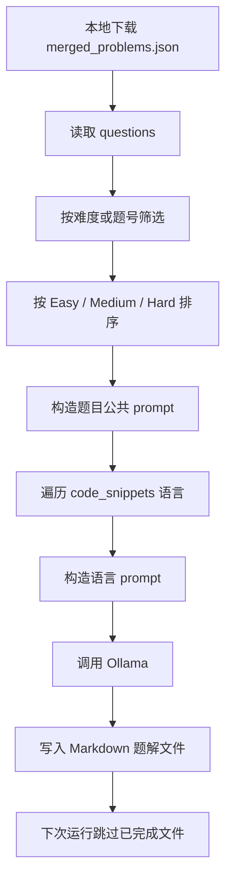
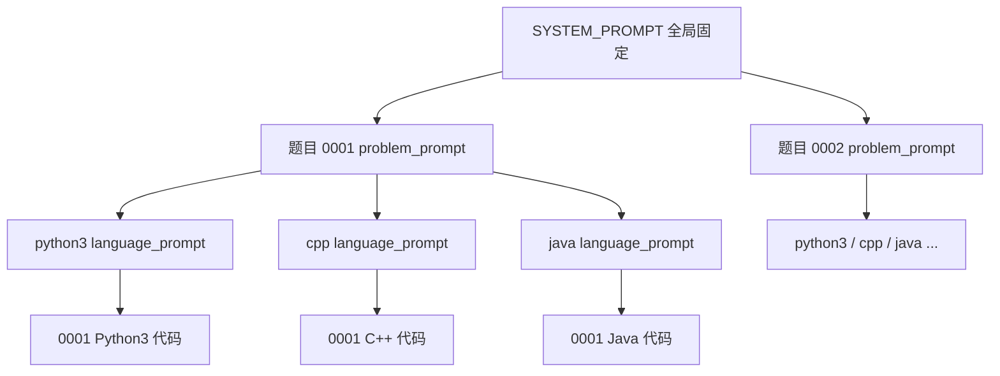
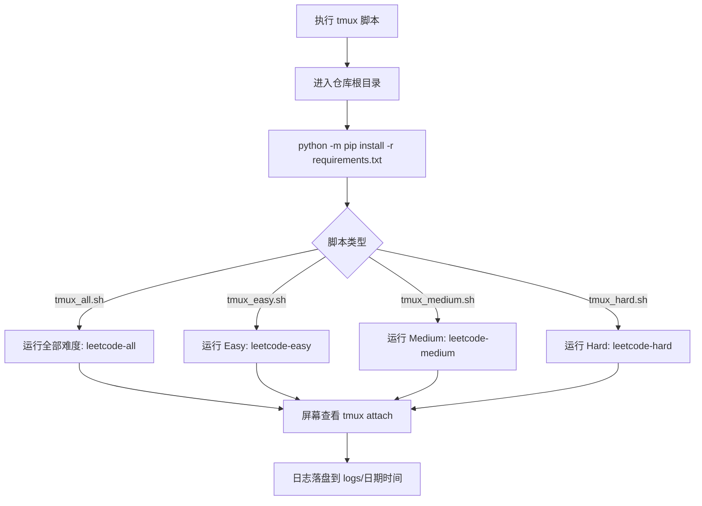
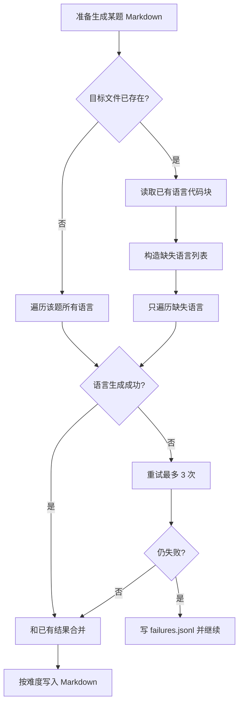
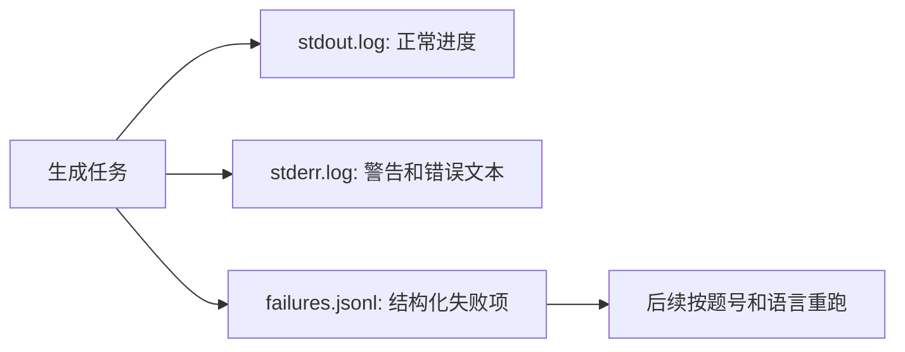
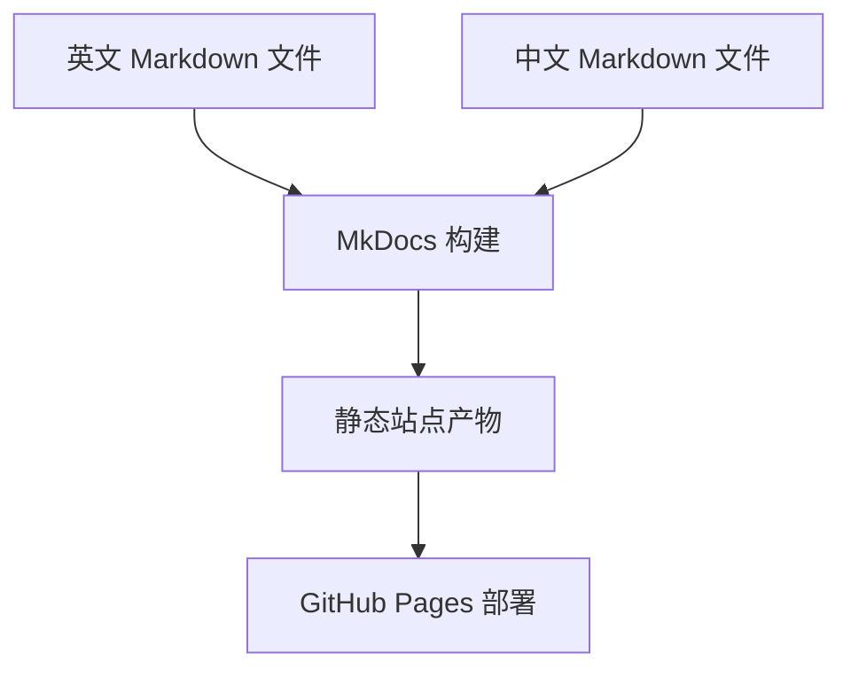
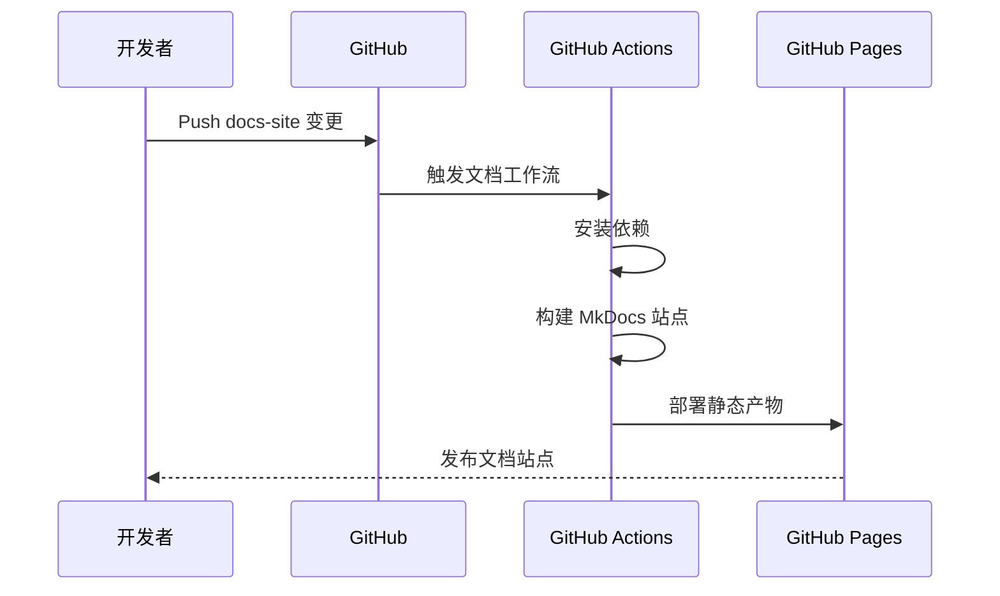

# 端到端工作流

本文说明生成器、文档站点和部署流程如何配合。

这套工作流的目标是让全量生成可以长时间运行、可以中断后继续、可以定位失败原因，并且让文档站点始终解释当前仓库的真实行为。

## 生成流程



## 运行意图

- `merged_problems.json` 不提交到仓库，生成时由本地下载，避免把大数据文件放进 Git。
- 题目公共 prompt 使用题目有用字段，但跳过 `images`，因为当前模型不是多模态模型。
- 语言 prompt 只包含目标语言和 starter code，保证同一道题切换语言时只改变最小输入。
- Easy 使用 `low` think，Medium 使用 `medium` think，Hard 使用 `high` think，让推理强度和题目复杂度匹配。
- 单个语言失败后最多重试三次，仍失败则记录到 failures 日志并继续下一个语言或题目。
- 已存在的目标 Markdown 文件会被视为已完成，二次运行可以跳过，适合 tmux 长任务断点续跑。

## Prompt 复用路径



生成器把 prompt 拆成三层，是为了让相同内容尽量出现在请求前缀里。`SYSTEM_PROMPT` 负责所有稳定规则，`problem_prompt` 负责同一道题共享的信息，`language_prompt` 负责最小的语言差异。这个结构同时服务三个目标：模型更容易复用前缀、日志更容易定位问题、单语言失败时更容易重跑。

不要把题目、语言、输出格式要求每次拼成完全不同的一大段文本。那样会降低复用，也会让失败排查变困难。

## tmux 后台生成

tmux 脚本是面向长时间生成任务的入口。`scripts/tmux_all.sh` 生成全部难度；`scripts/tmux_easy.sh`、`scripts/tmux_medium.sh`、`scripts/tmux_hard.sh` 分别生成 Easy、Medium、Hard。每个脚本都会先安装根目录 `requirements.txt`，再启动对应的 tmux session。



依赖安装放在 tmux 启动之前，是为了让缺依赖这类环境问题直接出现在当前终端；真正的生成任务再进入后台运行。

常用命令：

```bash
scripts/tmux_all.sh
scripts/tmux_easy.sh
scripts/tmux_medium.sh
scripts/tmux_hard.sh
tmux ls
tmux attach -t leetcode-all
tmux attach -t leetcode-easy
tmux attach -t leetcode-medium
tmux attach -t leetcode-hard
tmux kill-session -t leetcode-all
tmux kill-session -t leetcode-easy
tmux kill-session -t leetcode-medium
tmux kill-session -t leetcode-hard
tmux kill-server
```

`tmux kill-session` 只取消本项目的当前生成任务；`tmux kill-server` 会取消所有 tmux session，应只在确认没有其他 tmux 工作时使用。

## 断点续跑和重跑策略



Easy 和 Medium 按题目粒度续跑。如果某题文件已经包含所有预期语言，就直接跳过；如果文件不完整，就补齐缺失语言，并在本次题目生成结束后写回一次 Markdown。

Hard 按语言粒度续跑。生成器会先读取 Markdown 中已有的语言代码块，跳过已经存在的语言；每生成完一个新的缺失语言，就把已有语言和新语言合并后写回文件。

如果 Hard 在生成 Kotlin 时中断，下次运行会保留这道题里已经写好的 Cpp、Java、Python 等语言，并从缺失的 Kotlin 继续，而不是从该题的 Cpp 重新开始。

## 日志和失败处理



stdout、stderr 和 failures 分开保存，是为了避免长时间运行后日志混在一起。屏幕输出用于观察进度；文件日志用于复盘；`failures.jsonl` 用于后续精确重跑。

日志目录按日期时间创建，例如：

```text
logs/
  2026-07-03_031520/
    stdout.log
    stderr.log
    failures.jsonl
```

`stdout.log` 保存正常进度和完成信息，`stderr.log` 保存 warning、异常和模型调用错误文本，`failures.jsonl` 保存机器可读的失败记录。

## 文档流程



## GitHub Actions 流程



文档站点根路径提供语言入口，`cn/` 和 `en/` 分别保存中文和英文页面。GitHub Actions 只负责构建和部署文档，不参与题解生成；题解生成依赖本地 Ollama 和本地数据文件。
