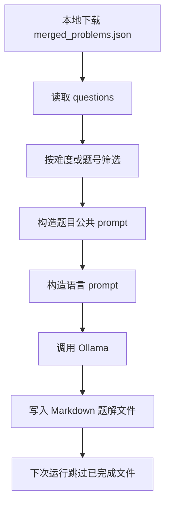
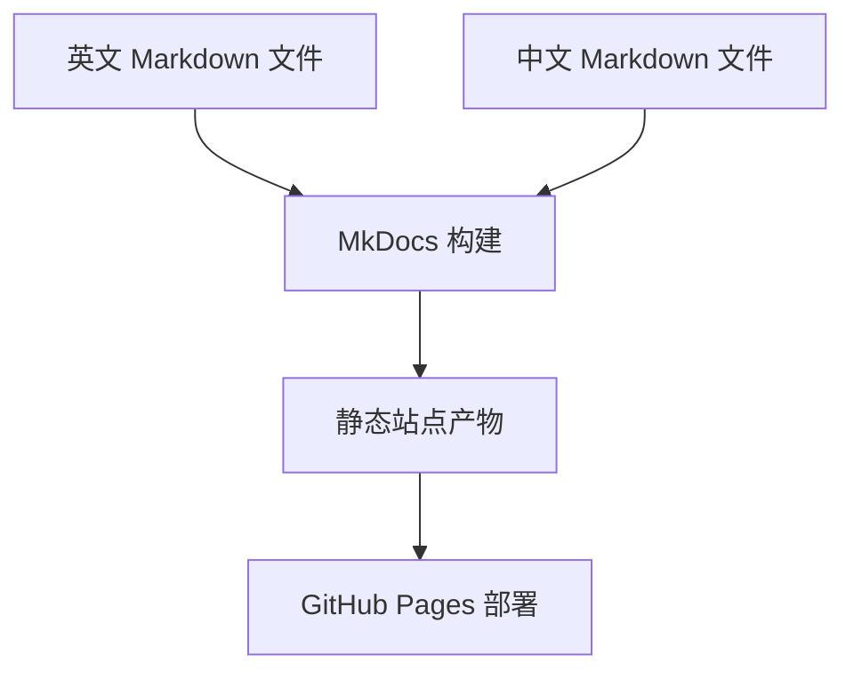
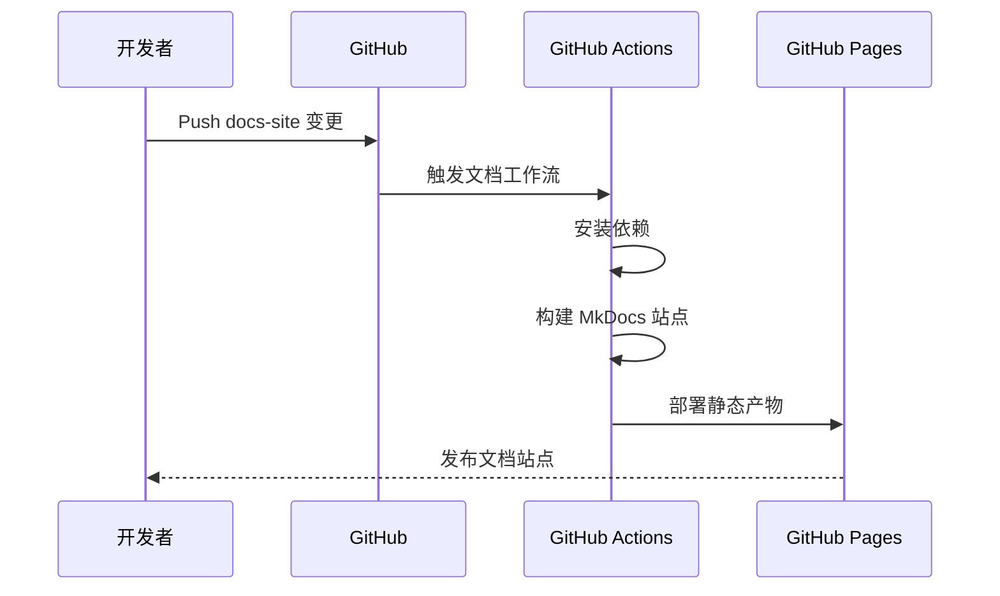

# 端到端工作流

本文说明生成器、文档站点和部署流程如何配合。

## 生成流程

```mermaid
flowchart TD
    A[本地下载 merged_problems.json] --> B[读取 questions]
    B --> C[按难度或题号筛选]
    C --> D[构造题目公共 prompt]
    D --> E[构造语言 prompt]
    E --> F[调用 Ollama]
    F --> G[写入 Markdown 题解文件]
    G --> H[下次运行跳过已完成文件]
```

## 文档流程

```mermaid
flowchart TD
    A[英文 Markdown 文件] --> C[MkDocs 构建]
    B[中文 Markdown 文件] --> C
    C --> D[静态站点产物]
    D --> E[GitHub Pages 部署]
```

## GitHub Actions 流程

```mermaid
sequenceDiagram
    participant Dev as 开发者
    participant GH as GitHub
    participant Action as GitHub Actions
    participant Pages as GitHub Pages

    Dev->>GH: Push docs-site 变更
    GH->>Action: 触发文档工作流
    Action->>Action: 安装依赖
    Action->>Action: 构建 MkDocs 站点
    Action->>Pages: 部署静态产物
    Pages-->>Dev: 发布文档站点
```

