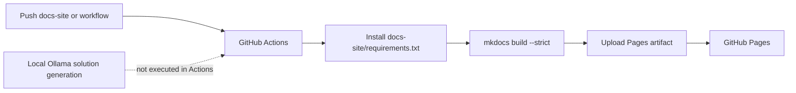

# GitHub Actions Plan

The GitHub Actions workflow should build and deploy the MkDocs site automatically.

The workflow has a narrow responsibility: publish documentation only. Solution generation depends on the local `merged_problems.json`, an Ollama service, and large-model hardware, so it should not run on GitHub-hosted runners.

## Trigger Rules

Recommended triggers:

- `push` to `main` when documentation site files change.
- `workflow_dispatch` for manual deployment.

The workflow should avoid running on unrelated code changes. Path filters should include:

- `docs-site/**`
- `.github/workflows/docs.yml`
- documentation entry files if needed

## Build Steps

1. Check out the repository.
2. Set up Python.
3. Install MkDocs and plugins.
4. Run `mkdocs build --strict`.
5. Upload the built site artifact.
6. Deploy to GitHub Pages.

## Deployment Boundary

Path filters reduce irrelevant runs: generator code changes do not always require documentation deployment, while changes under `docs-site/**` or `.github/workflows/docs.yml` should rebuild the site.

## Permissions

Use the minimum permissions required for GitHub Pages:

- `contents: read`
- `pages: write`
- `id-token: write`

These permissions cover repository reading, Pages artifact publishing, and OIDC deployment. The workflow does not need repository write access or model-service access.
