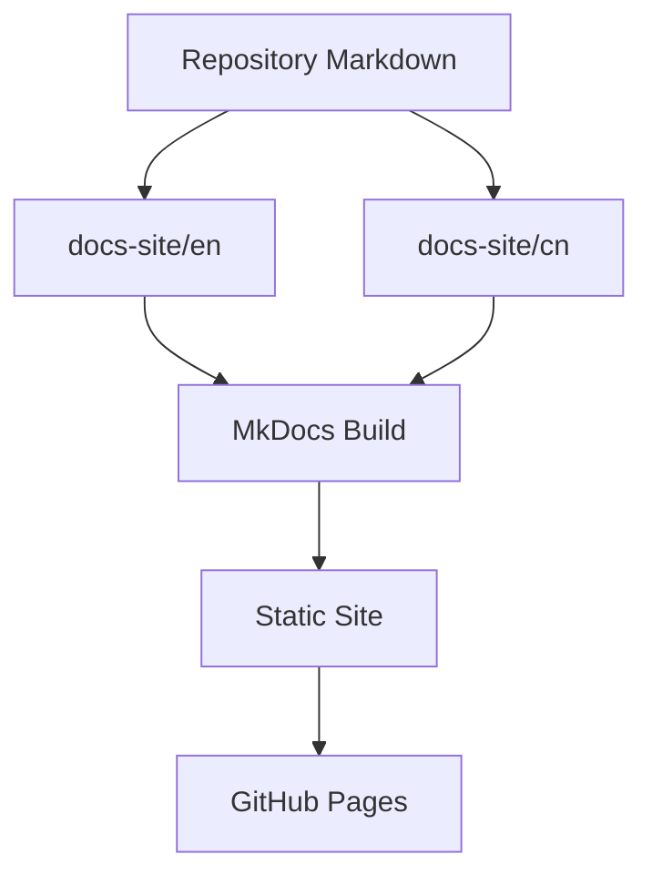

# Documentation Site Plan

This documentation set describes the planned MkDocs site and GitHub Actions workflow for the LeetCode All Languages Best Solutions project.

The site should explain the project to readers who may not know LeetCode, the supported programming languages, or how the local generation workflow works.

## File Structure

```text
docs-site/
  en/
    index.md
    leetcode.md
    languages.md
    ollama.md
    mkdocs.md
    github-actions.md
    workflow.md
    prd.md
  cn/
    index.md
    leetcode.md
    languages.md
    ollama.md
    mkdocs.md
    github-actions.md
    workflow.md
    prd.md
```

## Mermaid Overview



## Sections

- `leetcode.md`: what LeetCode is and what problem data looks like.
- `languages.md`: supported languages and their LeetCode submission styles.
- `ollama.md`: local generation workflow, think levels, temperature, and output limits.
- `mkdocs.md`: MkDocs site structure and bilingual navigation.
- `github-actions.md`: automated build and deploy workflow.
- `workflow.md`: end-to-end workflow diagrams.
- `prd.md`: implementation requirements for the documentation site.

