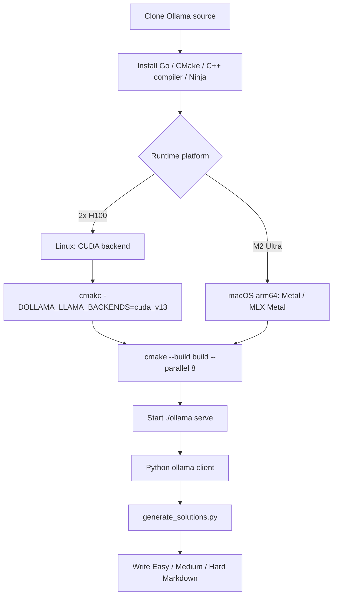
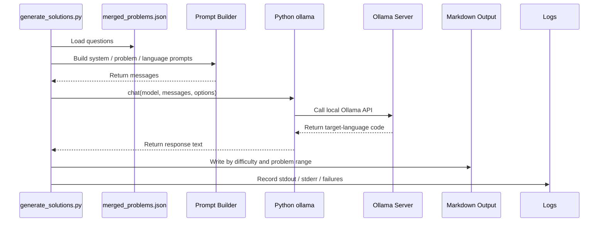
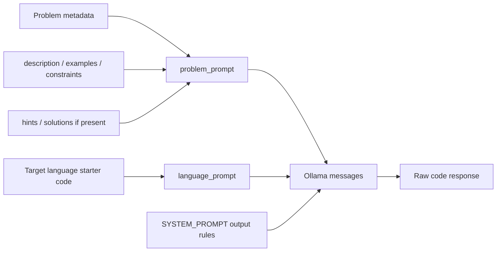
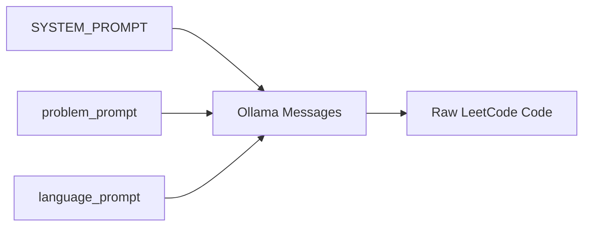

# Ollama Generation Workflow

The project uses the Python `ollama` package as the model client wrapper. Direct HTTP calls through `requests` are intentionally avoided.

Ollama removes most of the operational friction around running local models: model loading, local serving, and request handling are hidden behind a simple local API. For this project, the generator only needs to call that API through the Python `ollama` package.

The important point is that Ollama is used as a stable local inference service, not as an interactive chat tool. The generator owns dataset loading, prompt assembly, file output, and logging. Ollama owns model loading, inference execution, and response handling. This boundary keeps reruns and hardware changes from affecting the generator's core logic.

## Model Options

Current generation options:

- model: `gpt-oss:120b`
- local runtime target: q4km-style deployment
- Easy think mode: `low`
- Medium think mode: `medium`
- Hard think mode: `high`
- context length: `128k`, actually `131072` tokens
- max output tokens: `100000`
- temperature: `0.1`
- retry limit: `3`

Parameter intent:

- `gpt-oss:120b` is used because the project needs algorithm knowledge and correct submission shapes across many languages.
- `128k / 131072` context leaves enough room for statements, examples, constraints, hints, and optional editorial references.
- `100000` max output tokens is a per-language ceiling, preventing long or complex outputs from being truncated too early.
- `0.1` temperature reduces randomness and keeps repeated runs stable.
- Think mode increases with problem difficulty so reasoning budget is spent where it matters.

## Local Hardware Context

The tested local workstation is an Apple M2 Ultra machine with:

- 24 CPU cores
- 76 GPU cores
- 192 GB unified memory

An alternate compute target is a single Ollama node with 2x NVIDIA H100 GPUs. This serves the same project workflow: one node runs Ollama, receives the problem/language prompts, and writes generated solutions through the same repository tooling.

Under the tested local setup, throughput can reach about 100 tokens per second. This matters because the project generates solutions for many languages per problem, so local throughput directly affects full-dataset generation time.

For Apple Silicon, the documentation should mention MLX and MPS-oriented acceleration paths. For NVIDIA hardware, the 2x H100 node is the high-throughput option. The exact runtime choice can depend on the local Ollama build and model packaging, but the site should make it clear that this workflow is intended for high-memory local inference rather than a remote hosted API.

## Server Source Build

On our server, Ollama is prepared from source rather than treated only as a one-line installer. The reason is operational control: the server needs explicit native runtime, CUDA backend, and model-serving behavior, especially for the single-node 2x H100 setup.

Ollama itself is a Go project, but inference includes native code. The build is therefore not just a plain `go build`. The official development flow uses Go, CMake, a C/C++ compiler, and Ninja. From the repository root, `go run . serve` is useful for Go-layer iteration, while CMake builds the full native runtime payload.

The main NVIDIA server build path is:

```bash
git clone https://github.com/ollama/ollama.git
cd ollama
cmake -B build . -DOLLAMA_LLAMA_BACKENDS=cuda_v13 -DCMAKE_CUDA_ARCHITECTURES=native
cmake --build build --parallel 8
./ollama serve
```

If the MLX CUDA engine is used, the server also needs CUDA 13+ and cuDNN 9+, with `OLLAMA_MLX_BACKENDS` selecting the CUDA backend:

```bash
cmake -B build . -DOLLAMA_MLX_BACKENDS=cuda_v13
cmake --build build --parallel 8
```

The Apple Silicon path is different. macOS arm64 builds target Metal inference by default; MLX Metal requires Xcode and the Metal toolchain. The M2 Ultra workstation is useful for validating prompts, logs, and resumable generation. The H100 node is the long-running full-generation target.



## Generator Call Chain



The generator uses the Python `ollama` package instead of hand-written `requests` calls. The client library already handles Ollama API data structures and response wrapping, so project code can focus on problems, languages, output, and recovery.

## Prompt Boundary

The model receives textual problem data and the target language starter code. It does not receive images. If `solutions` exists, it is included as an editorial-style reference in the shared problem prompt; if missing, it is skipped. The final response must be submit-ready code only: no Markdown fences, no problem restatement, no complexity explanation, and no test harness.



## Why Local Generation Fits This Project

The project repeatedly sends a stable system prompt, a reusable problem prompt, and small language-specific prompts. This makes local generation attractive because:

- the same problem context is reused across many languages,
- the workflow can run without sending dataset content to a hosted API,
- failed languages can be retried locally,
- generated files can be resumed by checking existing Markdown output.

## Prompt Layers



- `SYSTEM_PROMPT`: global requirements shared by all problems and all languages.
- `problem_prompt`: problem metadata, statement, examples, constraints, hints, and optional editorial reference.
- `language_prompt`: target language plus that language's starter code.

This structure maximizes prompt reuse because only the final language prompt changes when generating another language for the same problem.

## Prompt Examples

The generator sends three Ollama messages in a fixed order:

```python
[
    {"role": "system", "content": SYSTEM_PROMPT},
    {"role": "user", "content": problem_prompt},
    {"role": "user", "content": language_prompt},
]
```

`SYSTEM_PROMPT` stores global rules and is identical for every problem and language. It constrains the model to submit-ready code only:

```text
You are a senior algorithm engineer and LeetCode solution generator.
Generate only the optimal accepted solution for the requested target language.
Use the provided LeetCode starter code signature and style exactly.
Return raw code only. Do not wrap the answer in Markdown code fences.
Do not include the problem statement, explanations, complexity analysis, tests,
main functions, extra I/O, pseudocode, or unsupported dependencies.
```

`problem_prompt` stores context shared by every language for the same problem. For LeetCode 1, the shape is roughly:

```text
# Problem Context

## Problem Metadata
- title: Two Sum
- problem_id: 1
- frontend_id: 1
- difficulty: Easy
- problem_slug: two-sum
- topics: Array, Hash Table

## Problem Statement
Given an array of integers nums and an integer target...

## Examples
- example_num: 1
- example_text: Input: nums = [2,7,11,15], target = 9 ...

## Constraints
- 2 <= nums.length <= 10^4

## Editorial / Solution Reference
Hash map based one-pass lookup...
```

`language_prompt` contains only the target language and starter code. For Python3:

```text
Target Language: python3

Use this LeetCode starter code signature and style:

class Solution:
    def twoSum(self, nums: List[int], target: int) -> List[int]:
        pass

Generate the optimal accepted solution for this language.
Return raw code only. Do not wrap the answer in Markdown code fences.
```

The output must preserve the LeetCode submission entry point, such as `class Solution` and `def twoSum(...)`. For Rust, Elixir, and Racket, the same rule applies to `impl Solution`, `defmodule Solution do`, and `define/contract`.

## Prompt Cache and Reuse

The cache idea here is not a hand-written key-value cache in the repository. It is about making the model server's input prefix as stable as possible. During LLM inference, stable long prefixes are easier for the serving layer to reuse. This project has two stable prefixes:

1. `SYSTEM_PROMPT`: identical across every problem and language.
2. `problem_prompt`: identical across every language for the same problem.

When generating many languages for one problem, requests look like this:

```text
Language 1: SYSTEM_PROMPT + problem_prompt(0001) + language_prompt(python3)
Language 2: SYSTEM_PROMPT + problem_prompt(0001) + language_prompt(cpp)
Language 3: SYSTEM_PROMPT + problem_prompt(0001) + language_prompt(java)
```

The first two layers stay unchanged; only the final language layer changes. This is more cache-friendly than mixing rules, problem data, and language requirements into a newly formatted prompt every time. It also makes debugging easier: if only one language fails for a problem, the likely issue is that language's starter code or output, not the shared problem prompt.

When the problem changes, `problem_prompt` changes, but `SYSTEM_PROMPT` remains stable:

```text
Problem 1: SYSTEM_PROMPT + problem_prompt(0001) + language_prompt(...)
Problem 2: SYSTEM_PROMPT + problem_prompt(0002) + language_prompt(...)
Problem 4: SYSTEM_PROMPT + problem_prompt(0004) + language_prompt(...)
```

This is why global rules belong in the system prompt, problem data belongs in the shared problem prompt, and language-specific differences should stay compressed in the language prompt.

## Failure Behavior

Each language can retry up to three times. After the retry limit, the failure is logged and generation continues with the next unit of work.

Non-blocking failure handling is intentional. A full run can take a long time, and one language, one problem, or one model timeout should not stop the entire batch. Failed units record the frontend id, slug, language, retry count, and error message so later runs can target only the missing work.
