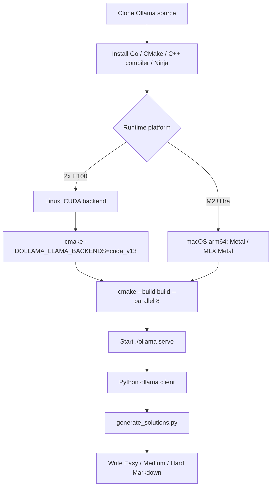
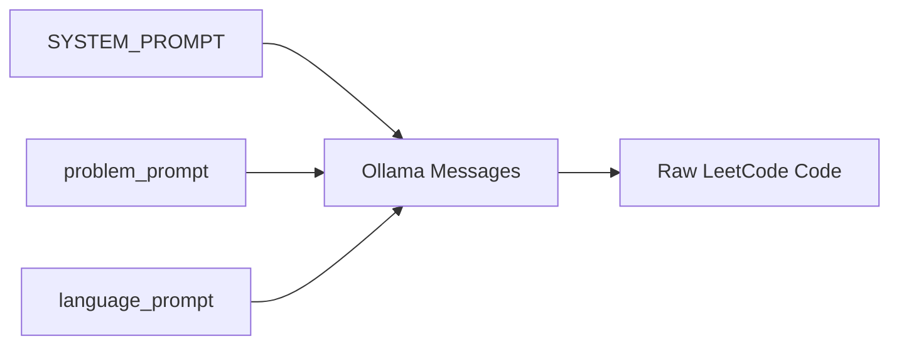

# Ollama Generation Workflow

The project uses the Python `ollama` package as the model client wrapper. Direct HTTP calls through `requests` are intentionally avoided.

Ollama removes most of the operational friction around running local models: model loading, local serving, and request handling are hidden behind a simple local API. For this project, the generator only needs to call that API through the Python `ollama` package.

## Model Options

Current generation options:

- model: `gpt-oss:120b`
- local runtime target: q4km-style deployment
- Easy think mode: `low`
- Medium think mode: `medium`
- Hard think mode: `high`
- context length: `128k`, actually `131072` tokens
- max output tokens: `100000`
- temperature: `0.1`
- retry limit: `3`

## Local Hardware Context

The tested local workstation is an Apple M2 Ultra machine with:

- 24 CPU cores
- 76 GPU cores
- 192 GB unified memory

An alternate compute target is a single Ollama node with 2x NVIDIA H100 GPUs. This serves the same project workflow: one node runs Ollama, receives the problem/language prompts, and writes generated solutions through the same repository tooling.

Under the tested local setup, throughput can reach about 100 tokens per second. This matters because the project generates solutions for many languages per problem, so local throughput directly affects full-dataset generation time.

For Apple Silicon, the documentation should mention MLX and MPS-oriented acceleration paths. For NVIDIA hardware, the 2x H100 node is the high-throughput option. The exact runtime choice can depend on the local Ollama build and model packaging, but the site should make it clear that this workflow is intended for high-memory local inference rather than a remote hosted API.

## Server Source Build

On our server, Ollama is prepared from source rather than treated only as a one-line installer. The reason is operational control: the server needs explicit native runtime, CUDA backend, and model-serving behavior, especially for the single-node 2x H100 setup.

Ollama itself is a Go project, but inference includes native code. The build is therefore not just a plain `go build`. The official development flow uses Go, CMake, a C/C++ compiler, and Ninja. From the repository root, `go run . serve` is useful for Go-layer iteration, while CMake builds the full native runtime payload.

The main NVIDIA server build path is:

```bash
git clone https://github.com/ollama/ollama.git
cd ollama
cmake -B build . -DOLLAMA_LLAMA_BACKENDS=cuda_v13 -DCMAKE_CUDA_ARCHITECTURES=native
cmake --build build --parallel 8
./ollama serve
```

If the MLX CUDA engine is used, the server also needs CUDA 13+ and cuDNN 9+, with `OLLAMA_MLX_BACKENDS` selecting the CUDA backend:

```bash
cmake -B build . -DOLLAMA_MLX_BACKENDS=cuda_v13
cmake --build build --parallel 8
```

The Apple Silicon path is different. macOS arm64 builds target Metal inference by default; MLX Metal requires Xcode and the Metal toolchain. The M2 Ultra workstation is useful for validating prompts, logs, and resumable generation. The H100 node is the long-running full-generation target.



## Why Local Generation Fits This Project

The project repeatedly sends a stable system prompt, a reusable problem prompt, and small language-specific prompts. This makes local generation attractive because:

- the same problem context is reused across many languages,
- the workflow can run without sending dataset content to a hosted API,
- failed languages can be retried locally,
- generated files can be resumed by checking existing Markdown output.

## Prompt Layers



- `SYSTEM_PROMPT`: global requirements shared by all problems and all languages.
- `problem_prompt`: problem metadata, statement, examples, constraints, hints, and optional editorial reference.
- `language_prompt`: target language plus that language's starter code.

This structure maximizes prompt reuse because only the final language prompt changes when generating another language for the same problem.

## Failure Behavior

Each language can retry up to three times. After the retry limit, the failure is logged and generation continues with the next unit of work.
