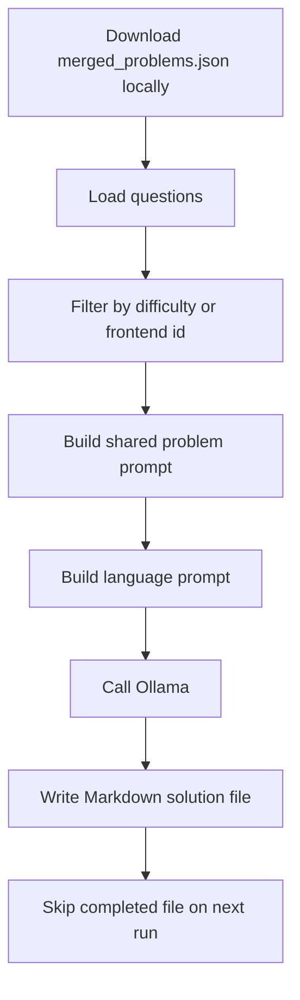
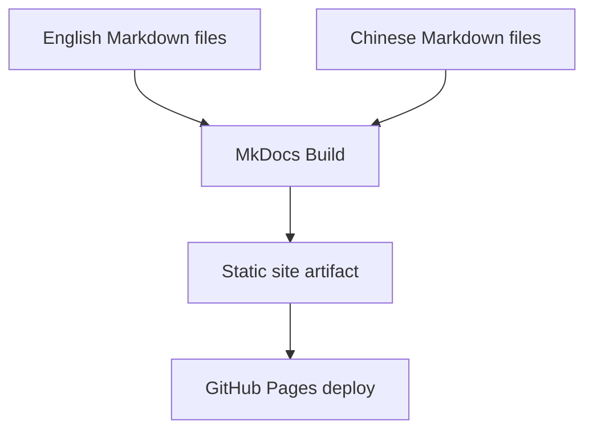
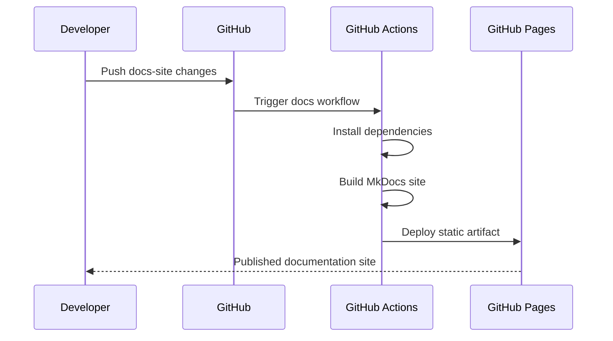

# End-to-End Workflow

This page explains how the generator, documentation site, and deployment workflow fit together.

## Generation Flow

```mermaid
flowchart TD
    A[Download merged_problems.json locally] --> B[Load questions]
    B --> C[Filter by difficulty or frontend id]
    C --> D[Build shared problem prompt]
    D --> E[Build language prompt]
    E --> F[Call Ollama]
    F --> G[Write Markdown solution file]
    G --> H[Skip completed file on next run]
```

## Documentation Flow

```mermaid
flowchart TD
    A[English Markdown files] --> C[MkDocs Build]
    B[Chinese Markdown files] --> C
    C --> D[Static site artifact]
    D --> E[GitHub Pages deploy]
```

## GitHub Actions Flow

```mermaid
sequenceDiagram
    participant Dev as Developer
    participant GH as GitHub
    participant Action as GitHub Actions
    participant Pages as GitHub Pages

    Dev->>GH: Push docs-site changes
    GH->>Action: Trigger docs workflow
    Action->>Action: Install dependencies
    Action->>Action: Build MkDocs site
    Action->>Pages: Deploy static artifact
    Pages-->>Dev: Published documentation site
```

