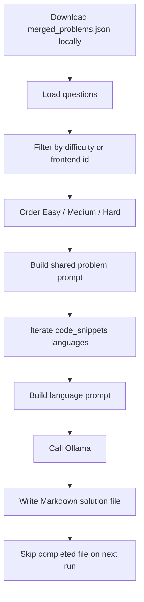
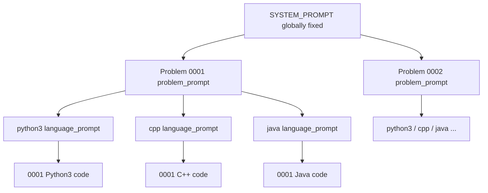
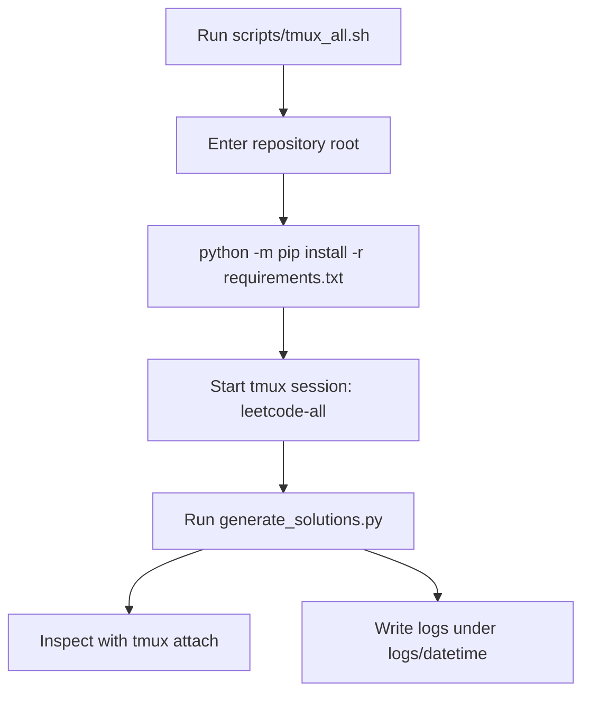
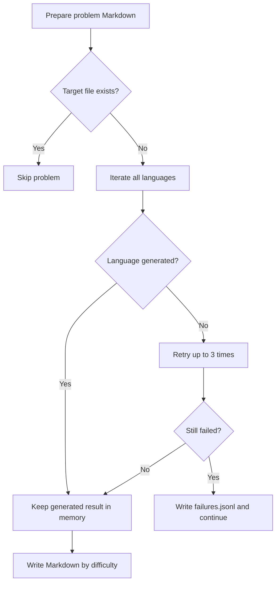
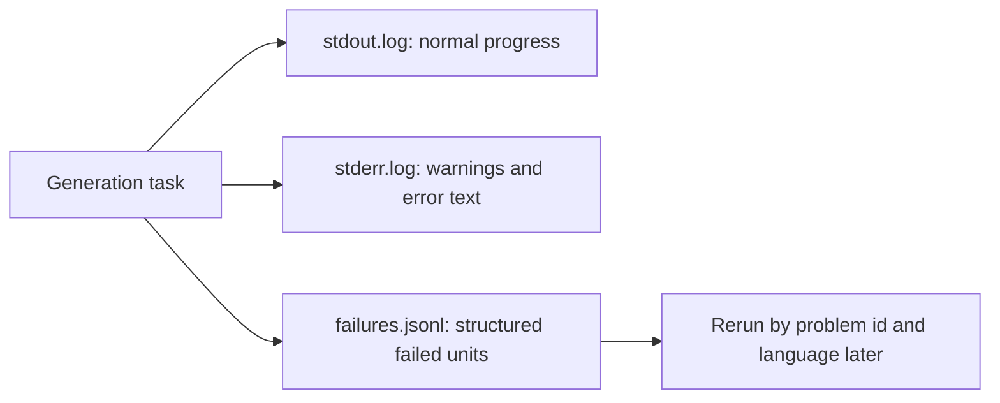
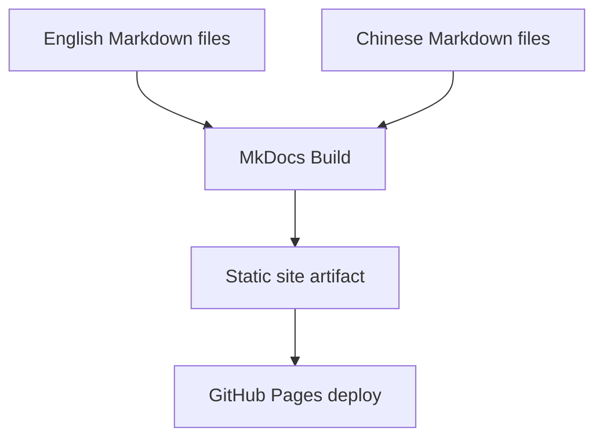
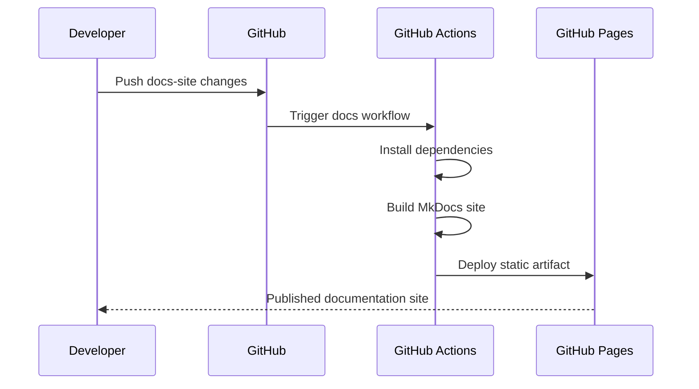

# End-to-End Workflow

This page explains how the generator, documentation site, and deployment workflow fit together.

The workflow is designed for long-running full generation: it can resume after interruption, keep failure data separate, and keep the documentation aligned with the repository's actual behavior.

## Generation Flow



## Runtime Intent

- `merged_problems.json` is downloaded locally and not committed, so the repository does not carry the large dataset file.
- The shared problem prompt uses useful problem fields but skips `images` because the current model is not multimodal.
- The language prompt contains only the target language and starter code, so switching languages changes the smallest possible input.
- Easy uses `low` think mode, Medium uses `medium`, and Hard uses `high`, matching reasoning effort to problem complexity.
- A failed language is retried up to three times. If it still fails, the failure is written to the failures log and the run continues.
- Existing target Markdown files are treated as completed output, so a second run can skip them and resume long tmux jobs.

## Prompt Reuse Path



The generator splits prompts into three layers so identical content stays near the request prefix. `SYSTEM_PROMPT` holds stable rules, `problem_prompt` holds shared data for one problem, and `language_prompt` holds the smallest language-specific delta. This supports three goals at once: better prefix reuse, easier debugging, and targeted reruns when one language fails.

Do not rebuild every request as a completely different block of mixed problem data, language requirements, and output rules. That reduces reuse and makes failures harder to diagnose.

## Full Generation With tmux

`scripts/tmux_all.sh` is the long-running full-generation entry point. It installs the root `requirements.txt` first, then starts a tmux session.



Dependency installation happens before tmux starts so environment failures appear in the current terminal. The actual generation then runs in the background.

Common commands:

```bash
scripts/tmux_all.sh
tmux ls
tmux attach -t leetcode-all
tmux kill-session -t leetcode-all
tmux kill-server
```

`tmux kill-session` cancels only this project's current generation task. `tmux kill-server` cancels every tmux session, so it should only be used when no other tmux work is running.

## Resume and Rerun Strategy



Easy and Medium write each problem Markdown once. Hard writes at language granularity. This reduces repeated I/O for normal cases while giving complex problems finer save points.

## Logs and Failure Handling



stdout, stderr, and failures are separated to keep long-running output readable. Screen output is for progress, file logs preserve the run context, and `failures.jsonl` supports targeted reruns.

The log directory is timestamped, for example:

```text
logs/
  2026-07-03_031520/
    stdout.log
    stderr.log
    failures.jsonl
```

`stdout.log` stores normal progress and completion messages, `stderr.log` stores warnings, exceptions, and model-call error text, and `failures.jsonl` stores machine-readable failed units.

## Documentation Flow



## GitHub Actions Flow



The site root provides language entry points, while `cn/` and `en/` hold the Chinese and English pages. GitHub Actions only builds and deploys documentation; solution generation depends on local Ollama and the local dataset file.
