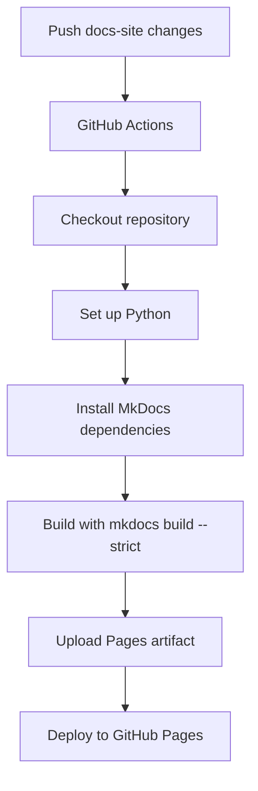

# GitHub Actions PRD for the Documentation Site

## Purpose

This PRD defines the GitHub Actions workflow required for this repository's documentation site.

The workflow is not a generic CI pipeline. It is specifically for the LeetCode All Languages Best Solutions project, whose documentation explains:

- what LeetCode is,
- how the dataset is obtained locally,
- how all-language solution files are generated,
- how the Ollama-based local generation workflow works,
- how the bilingual MkDocs documentation site is built and deployed.

The default source language for this PRD is English. The Chinese version lives at:

- `docs-site/cn/github_action_prd.md`

## Project Context

This repository generates accurate optimal LeetCode solutions across all supported languages. The generated solution files are organized into:

```text
Leetcode-Easy/
Leetcode-Medium/
Leetcode-Hard/
```

Each difficulty directory is further split into 100-problem buckets, for example:

```text
Leetcode-Easy/0001-0100/0001-two-sum.md
Leetcode-Medium/0001-0100/0002-add-two-numbers.md
Leetcode-Hard/0001-0100/0004-median-of-two-sorted-arrays.md
```

The documentation site should explain both the generated artifact structure and the engineering workflow used to produce it.

## LLM Runtime Context

The generation system uses a local Ollama model flow. The important documentation points are:

- model family: `gpt-oss:120b`
- quantization/runtime target: q4km-style local deployment
- target local workstation: Apple M2 Ultra with 24 CPU cores, 76 GPU cores, and 192 GB unified memory
- alternate compute node: one Ollama node with 2x NVIDIA H100 GPUs
- expected local throughput: approximately 100 tokens/second under the tested setup
- acceleration path: the model should be documented as suitable for Apple Silicon acceleration through MLX or MPS-oriented local inference paths, and also suitable for a single NVIDIA H100 node running Ollama
- generation options:
  - Easy -> think `low`
  - Medium -> think `medium`
  - Hard -> think `high`
  - temperature `0.1`
  - max output `100_000` tokens per language generation

The documentation should present these as runtime notes for the project, not as marketing copy.

## Workflow Goal

The GitHub Actions workflow must build and deploy the MkDocs documentation site automatically.

It should:

- run when documentation-site files change,
- support manual dispatch,
- install the MkDocs dependencies,
- build the site in strict mode,
- upload the static artifact,
- deploy to GitHub Pages.

## Expected File Layout

The documentation-site source should be organized as:

```text
docs-site/
  mkdocs.yml
  requirements.txt
  docs/
    en/
      index.md
      leetcode.md
      languages.md
      ollama.md
      mkdocs.md
      github-actions.md
      workflow.md
      prd.md
    cn/
      index.md
      leetcode.md
      languages.md
      ollama.md
      mkdocs.md
      github-actions.md
      workflow.md
      prd.md
```

The current planning files under `docs-site/en/` and `docs-site/cn/` can be used as the first draft content for that structure.

## Trigger Rules

The workflow should run on:

```yaml
on:
  push:
    branches: [main]
    paths:
      - "docs-site/**"
      - ".github/workflows/docs.yml"
  workflow_dispatch:
```

It should not run for unrelated source-code changes unless documentation files or the docs workflow change.

## Permissions

Use minimum required permissions:

```yaml
permissions:
  contents: read
  pages: write
  id-token: write
```

## Recommended Workflow



## Job Responsibilities

The workflow should contain one clear deployment job:

1. Checkout repository.
2. Set up Python.
3. Install documentation dependencies.
4. Build the MkDocs site.
5. Upload the generated static site.
6. Deploy to GitHub Pages.

Avoid mixing generator tests, dataset downloads, or solution generation into the documentation deployment job.

## Acceptance Criteria

The GitHub Actions implementation is acceptable when:

- `.github/workflows/docs.yml` exists.
- It supports `push` with path filters and `workflow_dispatch`.
- It builds the MkDocs site from `docs-site/`.
- It uses strict build mode.
- It deploys to GitHub Pages.
- The workflow is readable and project-specific enough to explain this repository, but not so coupled that it becomes hard to maintain.
