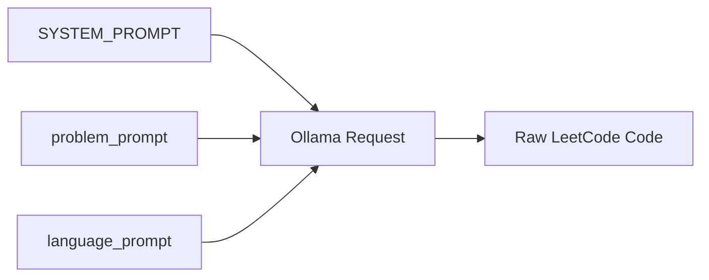
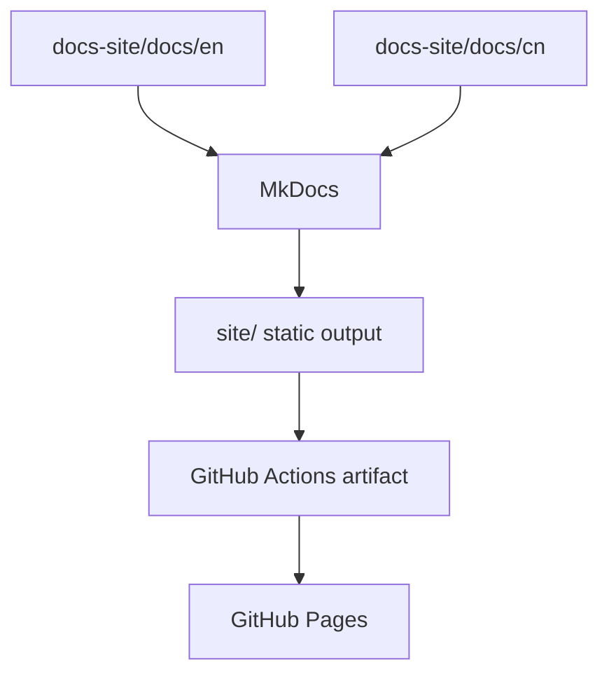

# MkDocs Bilingual Site PRD

## Purpose

This PRD defines the MkDocs documentation site for the LeetCode All Languages Best Solutions project.

The site should not be a generic placeholder. It should explain the actual project:

- LeetCode and its problem format,
- the supported programming languages,
- how solution Markdown files are organized,
- the local Ollama generation workflow,
- GitHub Actions deployment,
- the bilingual English/Chinese documentation structure.

The Chinese version lives at:

- `docs-site/cn/mkdocs_prd.md`

## Site Goals

The MkDocs site should help readers understand:

- what this repository produces,
- where the dataset comes from,
- why the output is split into `Leetcode-Easy/`, `Leetcode-Medium/`, and `Leetcode-Hard/`,
- how each problem file contains all generated language solutions,
- how prompt reuse works,
- how Ollama runs locally,
- how GitHub Actions publishes the documentation site.

## Content Architecture

The site should use English and Chinese folders:

```text
docs-site/
  docs/
    en/
    cn/
```

The two language trees should mirror each other as much as possible.

Recommended pages:

```text
en/
  index.md
  leetcode.md
  languages.md
  ollama.md
  mkdocs.md
  github-actions.md
  workflow.md
  prd.md

cn/
  index.md
  leetcode.md
  languages.md
  ollama.md
  mkdocs.md
  github-actions.md
  workflow.md
  prd.md
```

## Required Topics

### LeetCode

Explain LeetCode as an algorithm-practice platform. Describe common problem fields:

- title,
- frontend id,
- difficulty,
- topics,
- description,
- examples,
- constraints,
- hints,
- solution/editorial reference,
- language starter code.

### Languages

Explain that the project supports every language provided by the dataset's `code_snippets`, including:

C, C++, Java, Python, Python3, C#, JavaScript, TypeScript, PHP, Swift, Kotlin, Dart, Go, Ruby, Scala, Rust, Racket, Erlang, and Elixir.

Each language page or section should briefly explain the language's LeetCode submission style, such as `class Solution`, `impl Solution`, function signatures, modules, or contracts.

### Ollama Runtime

Explain the local generation setup in practical terms:

- Python `ollama` package is used.
- Direct `requests` calls are avoided.
- model: `gpt-oss:120b`
- local q4km-style runtime target
- Apple M2 Ultra target machine: 24 CPU cores, 76 GPU cores, 192 GB unified memory
- alternate target: one Ollama node with 2x NVIDIA H100 GPUs
- observed throughput can reach about 100 tokens/second in the tested setup
- MLX or MPS acceleration paths are relevant for Apple Silicon, while the 2x H100 node is the high-throughput NVIDIA option
- temperature is fixed at `0.1`
- output limit is `100_000` tokens
- Easy/Medium/Hard map to low/Leetcode-Medium/high think modes

### Prompt Reuse

Document the three-layer prompt layout:



Explain:

- system prompt is reused globally,
- problem prompt is reused across all languages for the same problem,
- language prompt changes only by target language and starter code,
- the final output must preserve the LeetCode submission entry point.

### GitHub Actions

Document how GitHub Actions builds the MkDocs site and deploys it to GitHub Pages.

## MkDocs Requirements

The MkDocs configuration should include:

- site name,
- theme configuration,
- navigation,
- Markdown extensions,
- Mermaid support,
- bilingual structure,
- GitHub Pages deployment compatibility.

## Mermaid Site Workflow



## Acceptance Criteria

The MkDocs documentation plan is complete when:

- English and Chinese folders exist.
- The site explains LeetCode, languages, Ollama, MkDocs, GitHub Actions, and workflow diagrams.
- The content is split into multiple files.
- Mermaid diagrams are included.
- The site plan is specific to this repository and current implementation.
